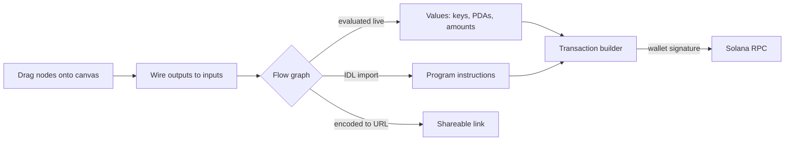

<p align="center">
  <a href="https://redduck.io/?utm_source=github&amp;utm_medium=readme&amp;utm_campaign=PLGRND">
    <picture>
      <source media="(prefers-color-scheme: dark)" srcset=".github/assets/redduck-logo-dark.svg">
      
    </picture>
  </a>
</p>

<h1 align="center">PLGRND</h1>

<p align="center">
  <b>Build Solana flows by dragging nodes — keypairs, PDAs, instructions, transactions — and run them against a live cluster.</b>
</p>

---

PLGRND is a visual playground for Solana. Instead of writing a script to derive an ATA, build an instruction and send a transaction, you wire together nodes on a canvas: each one is a ready, tested block of code with typed inputs and outputs. Values flow along the edges and evaluate live, so you see the actual public key, the actual lamport amount, the actual transaction at every step. Import a program's IDL and its instructions become nodes you can call. Every flow encodes into its own URL, so a working example is a link you can send to someone.

## Built with

| Area | Technology |
| --- | --- |
| App | React 19 + TypeScript, [Vite](https://vite.dev/) |
| Canvas | [React Flow](https://reactflow.dev/) (`@xyflow/react`) |
| Solana | [`@solana/web3.js`](https://github.com/solana-foundation/solana-web3.js), [`@solana/spl-token`](https://github.com/solana-program/token), [Anchor](https://www.anchor-lang.com/) for IDL decoding |
| Wallets | [Solana Wallet Adapter](https://github.com/anza-xyz/wallet-adapter) |
| Crypto | `tweetnacl`, `bip39`, `ed25519-hd-key`, `bs58` |
| State & data | [Zustand](https://zustand.docs.pmnd.rs/), [TanStack Query](https://tanstack.com/query) |
| UI | Tailwind CSS v4, Radix UI, `lucide-react`, `sonner` |
| Tooling | Yarn 4 workspaces, ESLint, Prettier |
| Deploy | Cloudflare Workers (`wrangler`) |

## How it works



1. Pick nodes from the menu and drop them on the canvas — each category maps to a piece of the Solana model.
2. Connect handles; the graph re-evaluates on every change, so downstream nodes update as you type.
3. Feed the result into a transaction builder, connect a wallet, and send it to the cluster of your choice.
4. Hit share — the whole graph is compressed into the URL hash. Open it in view mode to hand someone a read-only walkthrough, or embed it in an iframe.

## Node categories

| Category | Nodes |
| --- | --- |
| Input | Text, number, display, comment |
| Math / String / Logic | Arithmetic, combine, split, substring, search, replace, length, compare, equality, `if`, booleans |
| Crypto | Keypair, mnemonic, private key, hash, sign, verify signature |
| Wallet / Network | Connected wallet, cluster selection, balance |
| Utils | SOL ↔ lamports, token amounts, ATA derivation, rent exemption, public key validation, string encode/decode |
| Programs | IDL import, program instructions, program accounts, PDA derivation |
| Transactions | Transaction builder, transaction, transaction view |

Built-in example flows cover hashing, signature verification, balance checking, a SOL transfer and a program call — each one loads straight onto the canvas.

## Getting started

Prerequisites: Node.js v22 or higher, Yarn 4+.

```bash
yarn install    # install workspace dependencies
yarn web:dev    # run the web app in development mode
yarn web:build  # production build
```

Optionally set `VITE_PUBLIC_SOLANA_RPC` to point the app at your own RPC endpoint.

## License

[MIT](LICENSE)
