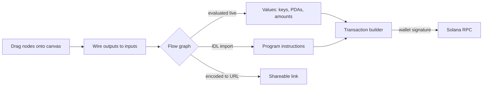

<p align="center">
  <a href="https://redduck.io/?utm_source=github&amp;utm_medium=readme&amp;utm_campaign=PLGRND">
    <picture>
      <source media="(prefers-color-scheme: dark)" srcset=".github/assets/redduck-logo-dark.svg">
      
    </picture>
  </a>
</p>

<h1 align="center">PLGRND</h1>

<p align="center">
  <b>Build Solana flows by dragging nodes — keypairs, PDAs, instructions, transactions — and run them against a live cluster.</b>
</p>

---

PLGRND is a visual playground for Solana. Instead of writing a script to derive an ATA, build an instruction and send a transaction, you wire together nodes on a canvas: each one is a ready, tested block of code with typed inputs and outputs. Values flow along the edges and evaluate live, so you see the actual public key, the actual lamport amount, the actual transaction at every step. Import a program's IDL and its instructions become nodes you can call. Every flow encodes into its own URL, so a working example is a link you can send to someone.


## Built with

| Area         | Technology                                                                                                                                                                                        |
| ------------ | ------------------------------------------------------------------------------------------------------------------------------------------------------------------------------------------------- |
| App          | React 19 + TypeScript, [Vite](https://vite.dev/)                                                                                                                                                  |
| Canvas       | [React Flow](https://reactflow.dev/) (`@xyflow/react`)                                                                                                                                            |
| Solana       | [`@solana/web3.js`](https://github.com/solana-foundation/solana-web3.js), [`@solana/spl-token`](https://github.com/solana-program/token), [Anchor](https://www.anchor-lang.com/) for IDL decoding |
| Wallets      | [Solana Wallet Adapter](https://github.com/anza-xyz/wallet-adapter)                                                                                                                               |
| Crypto       | `tweetnacl`, `bip39`, `ed25519-hd-key`, `bs58`                                                                                                                                                    |
| State & data | [Zustand](https://zustand.docs.pmnd.rs/), [TanStack Query](https://tanstack.com/query)                                                                                                            |
| UI           | Tailwind CSS v4, Radix UI, `lucide-react`, `sonner`                                                                                                                                               |
| Tooling      | Yarn 4 workspaces, ESLint, Prettier                                                                                                                                                               |
| Deploy       | Cloudflare Workers (`wrangler`)                                                                                                                                                                   |

## How it works



1. Pick nodes from the menu and drop them on the canvas — each category maps to a piece of the Solana model.
2. Connect handles; the graph re-evaluates on every change, so downstream nodes update as you type.
3. Feed the result into a transaction builder, connect a wallet, and send it to the cluster of your choice.
4. Hit share — the whole graph is compressed into the URL hash. Hand someone the link, or use **Share → Embed** to generate a themed interactive widget for any page (see [Embedding](#embedding)).

## Node categories

| Category              | Nodes                                                                                                       |
| --------------------- | ----------------------------------------------------------------------------------------------------------- |
| Input                 | Text, number, display, comment                                                                              |
| Math / String / Logic | Arithmetic, combine, split, substring, search, replace, length, compare, equality, `if`, booleans           |
| Crypto                | Keypair, mnemonic, private key, hash, sign, verify signature                                                |
| Wallet / Network      | Connected wallet, cluster selection, balance                                                                |
| Utils                 | SOL ↔ lamports, token amounts, ATA derivation, rent exemption, public key validation, string encode/decode |
| Programs              | IDL import, program instructions, program accounts, PDA derivation                                          |
| Transactions          | Transaction builder, transaction, transaction view                                                          |

Built-in example flows cover hashing, signature verification, balance checking, a SOL transfer and a program call — each one loads straight onto the canvas.

## Embedding

Any PLGRND flow can be embedded on another site as an interactive widget — an `<iframe>` pointed at `/embed`, no JavaScript required on the host page:

```html
<div style="position:relative;width:100%;aspect-ratio:16/9;overflow:hidden;border-radius:12px">
  <iframe
    src="https://plgrnd.io/embed?theme=light&bg=e0deda&accent=ed4937#flow=…"
    title="PLGRND interactive flow"
    loading="lazy"
    sandbox="allow-scripts allow-same-origin allow-popups allow-popups-to-escape-sandbox"
    allow="clipboard-write"
    style="position:absolute;inset:0;width:100%;height:100%;border:0"
  ></iframe>
</div>
```

The easiest way to get a snippet is the built-in builder: open a flow, hit **Share → Embed**, tune the options against the live preview and copy the result.

### URL parameters

Options travel in the query string; the flow itself stays in the `#flow=` hash. Options are also accepted inside the hash after `?`, which keeps old links working. Invalid values never break rendering — they fall back to their defaults.

| Parameter  | Values                                                                      | Default        | Effect                             |
| ---------- | --------------------------------------------------------------------------- | -------------- | ---------------------------------- |
| `mode`     | `readonly` · `interactive` · `editor`                                       | `interactive`  | Interaction level (see below)      |
| `theme`    | `dark` · `light` · `auto`                                                   | `dark`         | Palette preset                     |
| `bg`       | hex without `#` (3, 4, 6 or 8 digits)                                       | from theme     | Canvas background                  |
| `surface`  | hex                                                                         | from theme     | Node bodies, panels, popovers      |
| `fg`       | hex                                                                         | from theme     | Text                               |
| `border`   | hex                                                                         | from theme     | Borders and input outlines         |
| `accent`   | hex                                                                         | from theme     | Highlights and focus ring          |
| `radius`   | integer `0`–`24`                                                            | `8`            | Corner radius in px                |
| `font`     | font-family string (letters, digits, spaces, `,`, quotes, `-`; ≤ 100 chars) | PLGRND default | UI font                            |
| `fontMono` | same rules                                                                  | PLGRND default | Monospace font                     |
| `controls` | `1`/`0`                                                                     | `1`            | Zoom/fit controls                  |
| `minimap`  | `1`/`0`                                                                     | `0`            | MiniMap                            |
| `toolbar`  | `1`/`0`                                                                     | `1`            | "Open in PLGRND" + "Reset" buttons |

Unknown parameters are ignored. `id=` is reserved for future server-stored flows and is read from the query string only. The "Powered by PLGRND" badge is always shown.

### Interaction modes

| Behaviour                                                | `readonly` | `interactive` | `editor` |
| -------------------------------------------------------- | ---------- | ------------- | -------- |
| Pan and zoom (Controls / pinch)                          | ✔         | ✔            | ✔       |
| Edit values inside nodes (inputs, `Generate`, `Refresh`) | ✖         | ✔            | ✔       |
| Move, connect, add or delete nodes                       | ✖         | ✖            | ✔       |
| Header with the node menu                                | ✖         | ✖            | ✔       |

Wallet connection and transaction sending are never available inside the widget: the Wallet node and `Send` deep-link to the full editor with the current canvas state instead. Read-only RPC (balances, account info, transaction views) keeps working.

### Theming

`theme=dark|light` picks a preset and the colour tokens above apply on top. **`theme=auto` follows the visitor's OS setting (`prefers-color-scheme`), not your site's own theme toggle** — if your site switches dark mode with a class or a button, pin `theme=` to the value you render, or drive the widget at runtime via `postMessage`.

Each widget posts `{ type: 'plgrnd:ready' }` to its **direct parent** once the flow has rendered (a nested shell must relay it upward if needed), and accepts exactly one inbound message shape — anything else is ignored:

```js
frame.contentWindow.postMessage({ type: 'plgrnd:theme', theme: 'dark' }, '*')
```

With several widgets on one page, resolve the sender via `event.source` — never guess iframes by `src`:

```html
<script>
  // Multi-widget-safe host-side theme sync.
  const hostTheme = () => (document.documentElement.classList.contains('dark') ? 'dark' : 'light')
  const widgets = new Set()
  window.addEventListener('message', (e) => {
    if (e.data?.type !== 'plgrnd:ready') return
    widgets.add(e.source)
    e.source.postMessage({ type: 'plgrnd:theme', theme: hostTheme() }, '*')
  })
  // Call this from your own theme toggle:
  const syncWidgets = () => widgets.forEach((w) => w.postMessage({ type: 'plgrnd:theme', theme: hostTheme() }, '*'))
</script>
```

Widget appearance is not trusted state: any script able to reach the widget's `contentWindow` — including third-party scripts on the host page — can change its theme. The message affects visuals only.

### Iframe requirements and behaviour

- `sandbox` needs `allow-scripts allow-same-origin`, plus `allow-popups allow-popups-to-escape-sandbox` for "Open in PLGRND" and the badge link; `allow="clipboard-write"` enables click-to-copy inside nodes. Without popup permissions the widget falls back to a copyable link in a toast.
- The mouse wheel over the widget scrolls the host page (same convention as embedded maps); zooming works through the Controls, pinch, or Ctrl/Cmd+wheel.
- Embeds are stateless: visitor edits live only inside the iframe, reloading it (or pressing Reset) restores the authored flow, and nothing is read from or written to the visitor's PLGRND storage.

### Legacy links

Old-style `https://plgrnd.io/#flow=…?view=true` links keep working — they are rewritten client-side to `/embed` with default options.

## Getting started

Prerequisites: Node.js v22 or higher, Yarn 4+.

```bash
yarn install    # install workspace dependencies
yarn web:dev    # run the web app in development mode
yarn web:build  # production build
```

Optionally set `VITE_PUBLIC_SOLANA_RPC` to point the app at your own RPC endpoint.

## License

[MIT](LICENSE)
